## Documento de Desenvolvimento de Componentes e Telas

Este documento serve como um guia para o desenvolvimento de componentes e telas do projeto em React utilizando Styled Components. Abaixo, cada componente e tela é detalhado com sua descrição e orientações para desenvolvimento. No final, é apresentada a estrutura de pastas a ser seguida.

---

## **Componentes**

### 1. **NavBar**
   - **Descrição:** Componente de navegação principal do site, presente em todas as páginas, exceto as de login e cadastro.
   - **Desenvolvimento:** 
     - **Entradas:** Nenhuma.
     - **Saídas:** Nenhuma.
     - **Instruções:** O componente deve incluir links para as principais seções do site (Início, Coleções, Curtidas e Transações), uma barra de pesquisa integrada, um ícone de perfil e a logo da empresa. Os links devem redirecionar o usuário para suas respectivas lojas. O ícone de usuário deve abrir um modal com as opções: Perfil e Sair (caso esteja cadastrado) ou Cadastro e Login (caso não esteja cadastrado). O ícone da empresa deve redirecionar para a Home Page. A barra de pesquisa é um componente separado.

   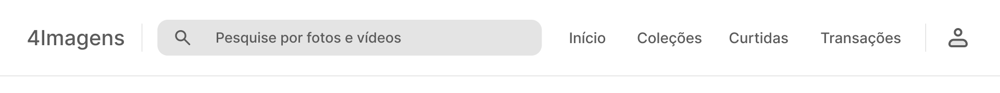


### 2. **Barra de Pesquisa**
   - **Descrição:** Campo de input para o usuário buscar por imagens ou coleções, retornando resultados para a pesquisa.
   - **Desenvolvimento:**
     - **Entradas:** Uma string (texto digitado pelo usuário).
     - **Saídas:** Resultados filtrados (array de objetos de imagens/coleções) ou uma mensagem de 'nenhum resultado encontrado'.
     - **Instruções:** O componente deve ser integrado com o backend para filtrar os resultados conforme o usuário digita. Deve receber o input como texto, fazer as requisições para o backend e retornar os resultados mais adequados ou informar que não há resultados.

   


### 3. **Footer**
   - **Descrição:** Rodapé do site, com um texto que convida o usuário para um possível contato com o Admin.
   - **Desenvolvimento:** 
     - **Entradas:** Nenhuma.
     - **Saídas:** Nenhuma.
     - **Instruções:** O rodapé deve conter texto e um ícone do WhatsApp que redireciona o usuário para o WhatsApp do admin.

   

### 4. **Botão**
   - **Descrição:** Botão genérico reutilizável em diversas partes da aplicação.
   - **Desenvolvimento:**
     - **Entradas:** Uma string (texto do botão) e uma função (callback para a ação do botão).
     - **Saídas:** Nenhuma.
     - **Instruções:** O botão deve suportar diferentes funcionalidades (submit, redirecionar, etc.), estados (ativo, desativado, pressionado, hover) e estilos (personalizar tamanho, texto e cores).

   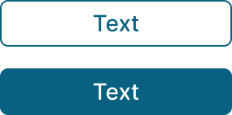

### 5. **Filtro**
   - **Descrição:** Componente que permite ao usuário filtrar imagens por categorias, cores, etc.
   - **Desenvolvimento:**
     - **Entradas:** Uma string (nome do filtro).
     - **Saídas:** Uma string (valor do filtro aplicado).
     - **Instruções:** O filtro deve funcionar de maneira semelhante a um botão. Ele deve ser estilizado de acordo com as personalizações e retornar uma string que será usada para filtrar os resultados posteriormente.

   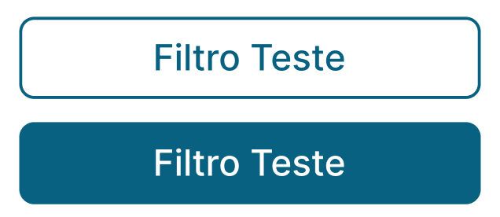


### 6. **Botão com Link**
   - **Descrição:** Botão que faz parte do menu suspenso.
   - **Desenvolvimento:** 
     - **Entradas:** Uma string (texto do botão) e uma string (URL de redirecionamento).
     - **Saídas:** Nenhuma.
     - **Instruções:** O botão deve ter um efeito de hover e, ao ser clicado, redirecionar o usuário para a rota especificada.

   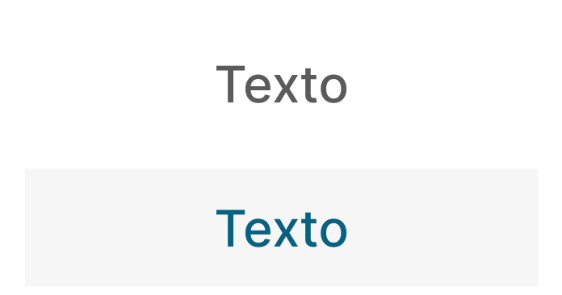


### 7. **Texto Link**
   - **Descrição:** Links textuais que redirecionam o usuário para diferentes seções do site.
   - **Desenvolvimento:** 
     - **Entradas:** Uma string (texto do link) e uma string (URL de redirecionamento).
     - **Saídas:** Nenhuma.
     - **Instruções:** O link deve ser estilizado para se diferenciar de texto normal e ter estados de hover adequados.

   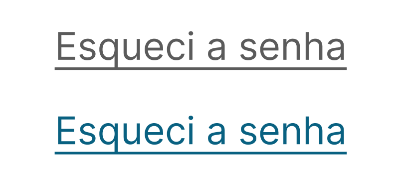


### 8. **Filtros de Imagens**
   - **Descrição:** Filtros visuais aplicáveis às imagens exibidas (e.g., preto e branco, sépia).
   - **Desenvolvimento:**
     - **Entradas:** Nenhuma.
     - **Saídas:** Nenhuma.
     - **Instruções:** Os filtros devem ter um efeito de hover, mas não precisam de interação; eles servem apenas para exemplificar o filtro aplicado à imagem atual.

   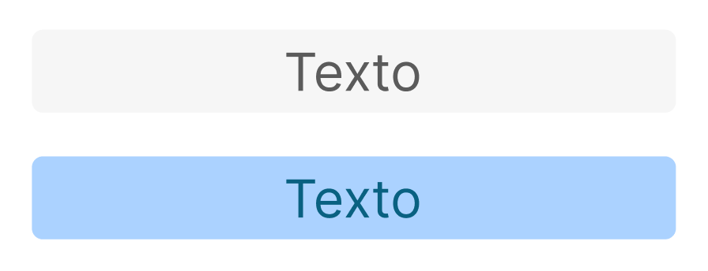

Aqui está o documento atualizado com as imagens convertidas para o formato Markdown e com tamanhos ajustados conforme especificado:

## **Componentes**

### 9. **Inputs**
   - **Descrição:** Campos de entrada de texto, números e outros dados.
   - **Desenvolvimento:**
     - **Entradas:** Variáveis de string, número ou outros tipos de dados, dependendo do tipo de input (text, password, email).
     - **Saídas:** O valor inserido pelo usuário.
     - **Instruções:** Os inputs devem ser estilizados de acordo com o design e incluir validações específicas para cada tipo.

   

### 10. **Esferas de Progresso**
   - **Descrição:** Indicadores circulares de progresso para mostrar o status de uma tarefa ou carregamento.
   - **Desenvolvimento:**
     - **Entradas:** Um número (percentual de progresso).
     - **Saídas:** Nenhuma.
     - **Instruções:** O componente deve ser animado e capaz de receber diferentes valores para indicar o progresso.

   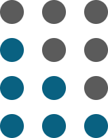

### 11. **Dropdown**
   - **Descrição:** Menu suspenso que exibe uma lista de opções ao ser clicado.
   - **Desenvolvimento:**
     - **Entradas:** Um array de strings (opções do dropdown).
     - **Saídas:** A opção selecionada (string).
     - **Instruções:** O componente deve suportar seleção única ou múltipla, com possibilidade de estilização personalizada.

   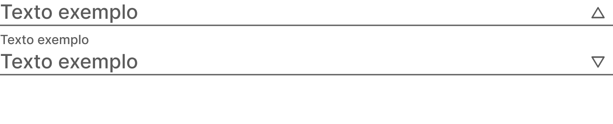

### 12. **Modal Genérico**
   - **Descrição:** Componente de janela modal reutilizável para diferentes contextos.
   - **Desenvolvimento:**
     - **Entradas:** Uma string (título do modal) e um array de objetos (conteúdo do modal).
     - **Saídas:** Nenhuma.
     - **Instruções:** Implementar suporte para diversos tamanhos e tipos de conteúdo.

   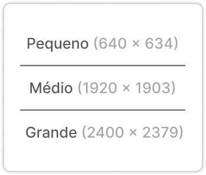

### 13. **Card Foto**
   - **Descrição:** Cartão que exibe uma foto com opções de descrição e download.
   - **Desenvolvimento:**
     - **Entradas:** Um objeto contendo uma imagem e uma string (descrição).
     - **Saídas:** Nenhuma.
     - **Instruções:** Deve haver suporte para visualização e download da imagem.

   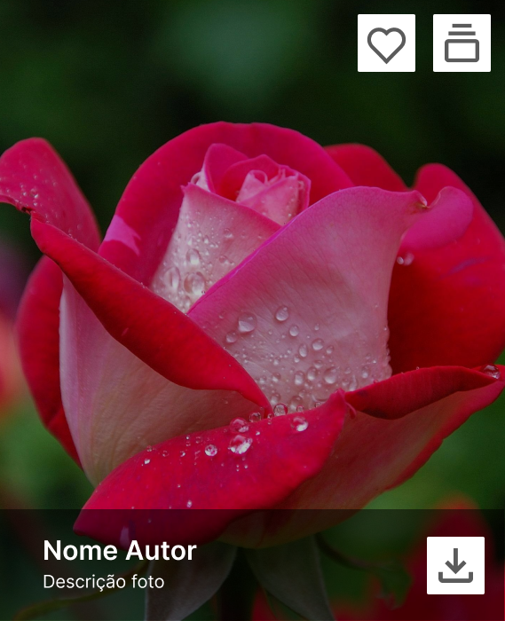

### 14. **Card Pedido**
   - **Descrição:** Cartão que exibe informações de um pedido realizado pelo usuário.
   - **Desenvolvimento:**
     - **Entradas:** Um objeto com os dados do pedido (ID, data, status, etc.).
     - **Saídas:** Nenhuma.
     - **Instruções:** O cartão deve exibir informações de status e ter um link para mais detalhes.

   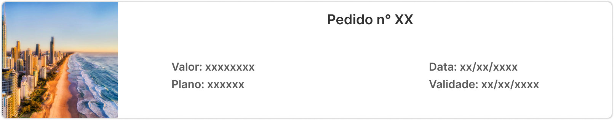

### 15. **Card Plano**
   - **Descrição:** Cartão que exibe detalhes sobre um plano de assinatura.
   - **Desenvolvimento:**
     - **Entradas:** Um objeto com detalhes do plano (nome, preço, benefícios).
     - **Saídas:** Nenhuma.
     - **Instruções:** Deve incluir opções para seleção do plano e exibir todos os benefícios de forma clara.

   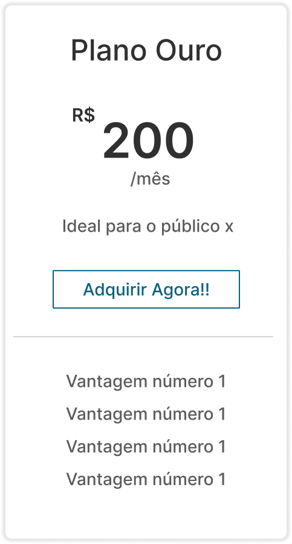

### 16. **Card Coleção**
   - **Descrição:** Cartão que exibe uma coleção de imagens com uma breve descrição.
   - **Desenvolvimento:**
     - **Entradas:** Um objeto com informações da coleção (nome, número de itens, imagem).
     - **Saídas:** Nenhuma.
     - **Instruções:** Deve permitir que o usuário clique para ver mais detalhes sobre a coleção.

   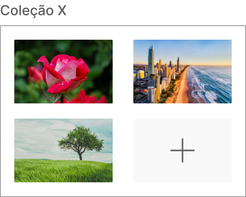

---

## **Modais**

### 1. **Modal Imagem Selecionada**
   - **Descrição:** Modal que exibe uma imagem selecionada, com opções de download e descrição.
   - **Desenvolvimento:**
     - **Entradas:** Um objeto contendo a URL da imagem, a descrição, e um booleano indicando se o modal deve estar aberto.
     - **Saídas:** Nenhuma.
     - **Instruções:** Deve incluir um botão para fechar o modal, ser responsivo para diferentes tamanhos de tela, e permitir o download da imagem exibida.

   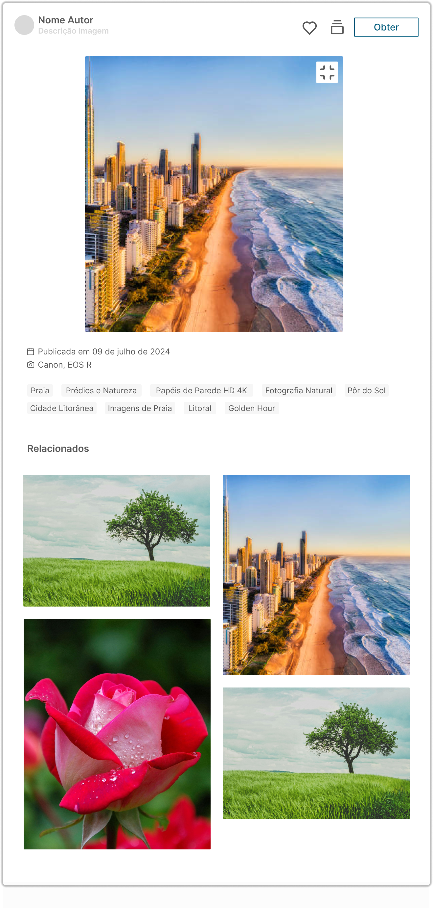

### 2. **Modal Plano**
   - **Descrição:** Modal que exibe informações detalhadas sobre os planos de assinatura, permitindo a seleção e confirmação do plano.
   - **Desenvolvimento:**
     - **Entradas:** Um objeto contendo os detalhes do plano (nome, preço, benefícios), e um booleano indicando se o modal deve estar aberto.
     - **Saídas:** Um objeto contendo as informações do plano selecionado quando o botão de confirmação for clicado.
     - **Instruções:** Deve incluir um botão de confirmação, ser responsivo, e suportar diferentes tipos de plano. O modal deve fechar automaticamente após a confirmação.

   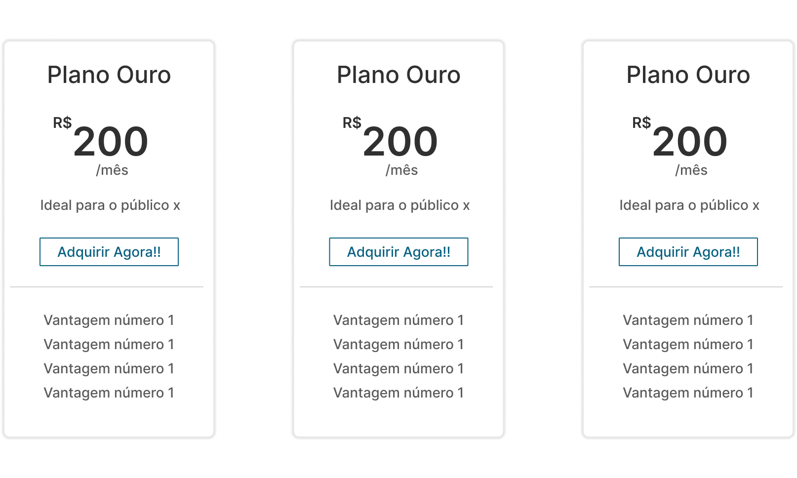

---

## **Telas**

### **Usuário**

1. **Tela Inicial**
   **Descrição:** Página principal do usuário com acesso rápido a coleções, imagens recomendadas, e filtros.
   

2. **Tela Perfil**
   **Descrição:** Exibe informações do perfil do usuário, como nome, email, e planos de assinatura.
   

3. **Tela Editar Perfil**
   **Descrição:** Permite ao usuário editar suas informações pessoais, como nome, email e foto de perfil.
   

4. **Tela Pagamentos**
   **Descrição:** Exibe histórico de pagamentos, detalhes de transações, e opções de métodos de pagamento.
   

5. **Tela Imagem Adquirida**
   **Descrição:** Mostra detalhes das imagens compradas pelo usuário, com opção para download.
   

6. **Tela Pedidos**
   **Descrição:** Lista de pedidos realizados pelo usuário, com detalhes e status de cada um.
   

7. **Tela Imagens Curtidas**
   **Descrição:** Exibe as imagens que o usuário marcou como curtidas, com opções para organizá-las ou adquirir.
   

8. **Tela Coleções**
   **Descrição:** Página onde o usuário pode visualizar e gerenciar suas coleções de imagens.
   

9. **Tela Dúvidas**
   **Descrição:** Página FAQ para ajudar o usuário com perguntas frequentes e suporte.
   

### **Login**

1. **Tela Cadastro Infos**
   **Descrição:** Página para o usuário cadastrar suas informações pessoais ao criar uma conta.
   

2. **Tela Cadastro Verificação**
   **Descrição:** Tela de verificação para confirmação do email ou telefone após o cadastro.
   

3. **Tela Cadastro Assinatura**
   **Descrição:** Permite ao usuário escolher um plano de assinatura durante o cadastro.
   

4. **Tela Login**
   **Descrição:** Página para login do usuário, com campos para email e senha.
   

5. **Tela Login Esqueceu a Senha**
   **Descrição:** Página para recuperação de senha, com envio de link de recuperação por email.
   

### **Admin**

1. **Tela Inicial**
   **Descrição:** Dashboard inicial do administrador, com visão geral das atividades.
   

2. **Tela Adicionar Fotos**
   **Descrição:** Interface para upload de novas imagens à plataforma, com categorização e tags.
   

3. **Tela Dashboard**
   **Descrição:** Exibe gráficos e estatísticas sobre o uso da plataforma e desempenho de vendas.
   

4. **Tela Assinaturas**
   **Descrição:** Gerenciamento de planos de assinatura, com opções para editar ou criar novos planos.
   

5. **Tela Criar Assinatura**
   **Descrição:** Interface específica para criação de novos planos de assinatura.
   

6. **Tela Editar Assinatura**
   **Descrição:** Página para editar detalhes de um plano de assinatura existente.
   

7. **Tela Relatório de Vendas**
   **Descrição:** Exibe relatórios detalhados sobre as vendas realizadas na plataforma.
   

8. **Tela Coleções**
   **Descrição:** Gerenciamento de coleções de imagens, com opções para criar ou editar coleções.
   

9. **Tela Criar Coleções**
   **Descrição:** Interface para criar uma nova coleção de imagens.
   

10. **Tela Criar Coleção (a partir de seleção do feed)**
    **Descrição:** Permite ao administrador criar uma coleção selecionando imagens diretamente do feed.
    .png)

11. **Tela Coleção Selecionada**
    **Descrição:** Detalhes de uma coleção específica, com opções para editar ou adicionar imagens.
    

12. **Tela Adicionar Imagens à Coleção (a partir da coleção)**
    **Descrição:** Interface para adicionar novas imagens a uma coleção existente.
    .png)

13. **Tela Adicionar Imagens à Coleções (a partir do feed)**
    **Descrição:** Similar à anterior, mas permite adicionar imagens a várias coleções a partir do feed.
    .png)


---

## **Estrutura de Pastas**

A estrutura de pastas deve ser modular e organizada, facilitando a manutenção e desenvolvimento simultâneo por várias pessoas. Segue uma sugestão de estrutura:

```
src/
│
├── assets/                     # Arquivos estáticos como imagens, fontes, etc.
│   ├── images/
│   ├── fonts/
│   └── icons/
│
├── components/                 # Componentes reutilizáveis
│   ├── NavBar/
│   │   ├── NavBar.jsx
│   │   ├── NavBar.styled.js
│   │   └── NavBar.test.jsx
│   ├── Footer/
│   │   ├── Footer.jsx
│   │   ├── Footer.styled.js
│   │   └── Footer.test.jsx
│   ├── Button/
│   │   ├── Button.jsx
│   │   ├── Button.styled.js
│   │   └── Button.test.jsx
│   ├── Dropdown/
│   │   ├── Dropdown.jsx
│   │   ├── Dropdown.styled.js
│   │   └── Dropdown.test.jsx
│   ├── SearchBar/
│   │   ├── SearchBar.jsx
│   │   ├── SearchBar.styled.js
│   │   └── SearchBar.test.jsx
│   ├── Filters/
│   │   ├── Filters.jsx
│   │   ├── Filters.styled.js
│   │   └── Filters.test.jsx
│   ├── ProgressCircles/
│   │   ├── ProgressCircles.jsx
│   │   ├── ProgressCircles.styled.js
│   │   └── ProgressCircles.test.jsx
│   ├── ImageCard/
│   │   ├── ImageCard.jsx
│   │   ├── ImageCard.styled.js
│   │   └── ImageCard.test.jsx
│   ├── OrderCard/
│   │   ├── OrderCard.jsx
│   │   ├── OrderCard.styled.js
│   │   └── OrderCard.test.jsx
│   ├── PlanCard/
│   │   ├── PlanCard.jsx
│   │   ├── PlanCard.styled.js
│   │   └── PlanCard.test.jsx
│   ├── CollectionCard/
│   │   ├── CollectionCard.jsx
│   │   ├── CollectionCard.styled.js
│   │   └── CollectionCard.test.jsx
│   ├── TextLink/
│   │   ├── TextLink.jsx
│   │   ├── TextLink.styled.js
│   │   └── TextLink.test.jsx
│   ├── InputField/
│   │   ├── InputField.jsx
│   │   ├── InputField.styled.js
│   │   └── InputField.test.jsx
│   └── LinkButton/
│       ├── LinkButton.jsx
│       ├── LinkButton.styled.js
│       └── LinkButton.test.jsx
│
├── modals/                     # Componentes de modal
│   ├── GenericModal/
│   │   ├── GenericModal.jsx
│   │   ├── GenericModal.styled.js
│   │   └── GenericModal.test.jsx
│   ├── ImageModal/
│   │   ├── ImageModal.jsx
│   │   ├── ImageModal.styled.js
│   │   └── ImageModal.test.jsx
│   ├── SubscriptionModal/
│   │   ├── SubscriptionModal.jsx
│   │   ├── SubscriptionModal.styled.js
│   │   └── SubscriptionModal.test.jsx
│   └── ChangePasswordModal/
│       ├── ChangePasswordModal.jsx
│       ├── ChangePasswordModal.styled.js
│       └── ChangePasswordModal.test.jsx
│
├── pages/                      # Páginas da aplicação
│   ├── User/
│   │   ├── HomePage/
│   │   │   ├── HomePage.jsx
│   │   │   ├── HomePage.styled.js
│   │   │   └── HomePage.test.jsx
│   │   ├── ProfilePage/
│   │   │   ├── ProfilePage.jsx
│   │   │   ├── ProfilePage.styled.js
│   │   │   └── ProfilePage.test.jsx
│   │   ├── EditProfilePage/
│   │   │   ├── EditProfilePage.jsx
│   │   │   ├── EditProfilePage.styled.js
│   │   │   └── EditProfilePage.test.jsx
│   │   ├── PaymentsPage/
│   │   │   ├── PaymentsPage.jsx
│   │   │   ├── PaymentsPage.styled.js
│   │   │   └── PaymentsPage.test.jsx
│   │   ├── AcquiredImagePage/
│   │   │   ├── AcquiredImagePage.jsx
│   │   │   ├── AcquiredImagePage.styled.js
│   │   │   └── AcquiredImagePage.test.jsx
│   │   ├── OrdersPage/
│   │   │   ├── OrdersPage.jsx
│   │   │   ├── OrdersPage.styled.js
│   │   │   └── OrdersPage.test.jsx
│   │   ├── LikedImagesPage/
│   │   │   ├── LikedImagesPage.jsx
│   │   │   ├── LikedImagesPage.styled.js
│   │   │   └── LikedImagesPage.test.jsx
│   │   ├── CollectionsPage/
│   │   │   ├── CollectionsPage.jsx
│   │   │   ├── CollectionsPage.styled.js
│   │   │   └── CollectionsPage.test.jsx
│   │   └── FaqPage/
│   │       ├── FaqPage.jsx
│   │       ├── FaqPage.styled.js
│   │       └── FaqPage.test.jsx
│   │
│   ├── Login/
│   │   ├── SignUpInfoPage/
│   │   │   ├── SignUpInfoPage.jsx
│   │   │   ├── SignUpInfoPage.styled.js
│   │   │   └── SignUpInfoPage.test.jsx
│   │   ├── SignUpVerificationPage/
│   │   │   ├── SignUpVerificationPage.jsx
│   │   │   ├── SignUpVerificationPage.styled.js
│   │   │   └── SignUpVerificationPage.test.jsx
│   │   ├── SubscriptionSignUpPage/
│   │   │   ├── SubscriptionSignUpPage.jsx
│   │   │   ├── SubscriptionSignUpPage.styled.js
│   │   │   └── SubscriptionSignUpPage.test.jsx
│   │   ├── LoginPage/
│   │   │   ├── LoginPage.jsx
│   │   │   ├── LoginPage.styled.js
│   │   │   └── LoginPage.test.jsx
│   │   └── ForgotPasswordPage/
│   │       ├── ForgotPasswordPage.jsx
│   │       ├── ForgotPasswordPage.styled.js
│   │       └── ForgotPasswordPage.test.jsx
│   │
│   └── Admin/
│       ├── AdminHomePage/
│       │   ├── AdminHomePage.jsx
│       │   ├── AdminHomePage.styled.js
│       │   └── AdminHomePage.test.jsx
│       ├── AddPhotosPage/
│       │   ├── AddPhotosPage.jsx
│       │   ├── AddPhotosPage.styled.js
│       │   └── AddPhotosPage.test.jsx
│       ├── DashboardPage/
│       │   ├── DashboardPage.jsx
│       │   ├── DashboardPage.styled.js
│       │   └── DashboardPage.test.jsx
│       ├── SubscriptionsPage/
│       │   ├── SubscriptionsPage.jsx
│       │   ├── SubscriptionsPage.styled.js
│       │   └── SubscriptionsPage.test.jsx
│       ├── CreateSubscriptionPage/
│       │   ├── CreateSubscriptionPage.jsx
│       │   ├── CreateSubscriptionPage.styled.js
│       │   └── CreateSubscriptionPage.test.jsx
│       ├── EditSubscriptionPage/
│       │   ├── EditSubscriptionPage.jsx
│       │   ├── EditSubscriptionPage.styled.js
│       │   └── EditSubscriptionPage.test.jsx
│       ├── SalesReportPage/
│       │   ├── SalesReportPage.jsx
│       │   ├── SalesReportPage.styled.js
│       │   └── SalesReportPage.test.jsx
│       ├── CollectionsPage/
│       │   ├── CollectionsPage.jsx
│       │   ├── CollectionsPage.styled.js
│       │   └── CollectionsPage.test.jsx
│       ├── CreateCollectionPage/
│       │   ├── CreateCollectionPage.jsx
│       │   ├── CreateCollectionPage.styled.js
│       │   └── CreateCollectionPage.test.jsx
│       ├── SelectedCollectionPage/
│       │   ├── SelectedCollectionPage.jsx
│       │   ├── SelectedCollectionPage.styled.js
│       │   └── SelectedCollectionPage.test.jsx
│       ├── AddImagesToCollectionPage/
│       │   ├── AddImagesToCollectionPage.jsx
│       │   ├── AddImagesToCollectionPage.styled.js
│       │   └── AddImagesToCollectionPage.test.jsx
│       └── AddImagesToCollectionsFromFeedPage/
│           ├── AddImagesToCollectionsFromFeedPage.jsx
│           ├── AddImagesToCollectionsFromFeedPage.styled.js
│           └── AddImagesToCollectionsFromFeedPage.test.jsx
│
├── utils/                      # Funções utilitárias e helpers
│   ├── formatDate.js
│   └── api.js
│
├── hooks/                      # Custom hooks
│   ├── useFetch.js
│   └── useAuth.js
│
├── context/                    # Context API para gerenciamento de estado
│   ├── AuthContext.js
│   ├── CartContext.js
│   └── ThemeContext.js
│
├── services/                   # Serviços para chamadas de API
│   ├── authService.js
│   ├── userService.js
│   ├── productService.js
│   └── adminService.js
│
├── styles/                     # Estilos globais e temas
│   ├── GlobalStyle.js
│   └── theme.js
│
├── App.jsx                     # Componente principal da aplicação
├── index.js                    # Ponto de entrada da aplicação
└── setupTests.js               # Configuração para testes

```